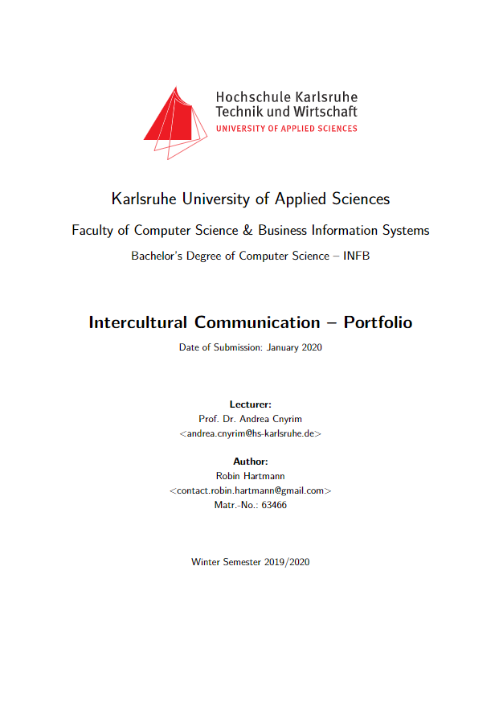

# 📄 paper-intercultural-communication-portfolio-title

Deckblatt für mein Portfolio der Vorlesung Intercultural Communication der HsKA

## 🛠️ Verwendung

Folgen Sie diesen Anweisungen, um dieses Projekt auf Ihrem lokalen Rechner einzurichten und es zu verwenden.

### 📋 Voraussetzungen

- LaTeX Distribution
  - bspw. [MiKTeX](https://miktex.org/howto/install-miktex)
- Perl Distribution
  - bspw. [ActivePerl](https://www.activestate.com/products/perl/downloads/)
    - Stellen Sie sicher, dass der Installer den Ordner mit den Executables zum `PATH` hinzufügt
- [Visual Studio Code](https://code.visualstudio.com/) mit der Erweiterung [LaTeX Workshop](https://marketplace.visualstudio.com/items?itemName=James-Yu.latex-workshop)

### 🚀 Erste Schritte

| Pfad              | Inhalt                       | Anmerkung                                                                                                                    |
| ----------------- | ---------------------------- | ---------------------------------------------------------------------------------------------------------------------------- |
| `src/`            | Quellcode des Dokuments      |                                                                                                                              |
| - `base/`         | Grundlegende Konfigurationen |                                                                                                                              |
| -- `styles/`      | Styles bzw. Layouts          |                                                                                                                              |
| --- `page.tex`    | Style von Seiten             |                                                                                                                              |
| --- `title.tex`   | Style des Deckblatts         |                                                                                                                              |
| -- `packages.tex` | Verwendete Packages          |                                                                                                                              |
| - `images/`       | Bilder                       | Hier werden alle Bilder abgelegt.                                                                                            |
| - `meta.tex`      | Metadaten des Dokuments      | Hier wird hauptsächlichder Inhalt des Deckblatts festgelegt.                                                                 |
| - `root.tex`      | Dokumentenstamm              | Hier wird die Struktur des Dokuments festgelegt und alle Bestandteile geladen. Diese Datei sollte nicht umbenannt werden. |

Der Build wird automatisch gestartet, wenn eine `.tex`-Datei gespeichert wird. Alternativ kann der Build über `Seitenmenü > LaTeX > Build LaTeX project` gestartet werden. Die erzeugte PDF-Datei wird unter `out/root.pdf` abgelegt. Es wird empfohlen den Dateinamen der PDF-Datei vor Auslieferung entsprechend dem Titel und/oder Untertitel des Dokuments anzupassen. Alle übrigen Dateien und Ordner in `out/` sind temporär und können ohne Bedenken gelöscht werden.

Mehr Informationen und eine Beispieldokumentation auf Basis der zugrundeliegenden Vorlage gibt es [hier](http://fiae.link/LaTeXVorlageFIAE).

## 🐞 Troubleshooting

### Das Formatieren von `.tex`-Dateien bricht ab mit dem Fehler `Can't locate Log/Log4perl.pm in @INC`

Dies bedeutet, dass der verwendete Formatierer `latexindent` nur in Form einer Perl-Executable vorliegt und nicht alle Abhängigkeiten installiert sind. Die einfachste Möglichkeit dies unter Windows zu beheben ist einfach stattdessen die `latexindent.exe` zu verwenden. MiKTeX enthält zwar eine `latexindent.exe`, aber diese leitet Befehle nur zur Perl-Executable weiter. Deswegen müssen die folgenden Schritte durchgeführt werden, um die korrekte `latexindent.exe` zu verwenden:

1. MiKTeX Console öffnen
2. Unter `Packages` das Paket `latexindent` deinstallieren
3. Eingabeaufforderung öffnen
4. `where latexindent.exe` ausführen
5. Falls ein Pfad ausgegeben wird, die Datei unter diesem Pfad löschen
6. Schritte 3-5 wiederholen, bis kein Pfad mehr ausgegeben wird
7. Das `latexindent` Paket von [CTAN](https://ctan.org/tex-archive/support/latexindent) herunterladen
8. Die heruntergeladene Zip-Datei in einen beliebigen Ordner entpacken
9. Diesen Ordner zum `PATH` hinzufügen
10. Alle Fenster von VS Code schließen und erneut öffnen

### Der Build bricht ab

Öffnen Sie die Ausgabe-Konsole und wechseln Sie zur Ausgabe von `LaTeX Compiler`. Suchen Sie nach `error`. Im Folgenden sind ein paar typische Fehlermeldungen und mögliche Lösungen aufgelistet:

#### `LaTeX fatal error: spawn latexmk ENOENT, . PID: undefined.`

Dies bedeutet, dass LaTeX Workshop nicht die `latexmk`-Executable im `PATH` finden konnte. Schließen Sie alle Fenster von VS Code und öffnen Sie diese erneut. Falls das Problem weiterhin besteht, stellen Sie sicher, dass Sie eine LaTeX Distribution installiert haben und der Ordner mit den entsprechenden Executables im `PATH` enthalten ist.

#### `latexmk: The script engine could not be found.`

Dies bedeutet, dass `latexmk` nicht die Perl-Executable im `PATH` finden konnte. Schließen Sie alle Fenster von VS Code und öffnen Sie diese erneut. Falls das Problem weiterhin besteht, stellen Sie sicher, dass Sie eine Perl Distribution installiert haben und der Ordner mit den entsprechenden Executables im `PATH` enthalten ist.

### Der erste Build dauert sehr lange

Dies ist normal wenn MiKTeX verwendet wird, denn es müssen erst einmal alle benötigten Pakete heruntergeladen werden. Aber stellen Sie sicher, dass Sie nicht einen Paket-Installations-Dialog von MiKTeX übersehen haben, der immer noch offen ist. In diesem Fall würde der Buildvorgang so lange hängen, wie der Dialog noch offen ist. Und solange Sie nicht MiKTeX erlaubt haben Pakete zu installieren ohne nachzufragen, wird der Dialog jedes mal erneut geöffnet, wenn ein Paket installiert werden muss.

## 🧰 Erstellt Mit

- [LaTeX](https://www.latex-project.org/) - Ein Dokumentaufbereitungssystem
- [template-paper-latex](https://github.com/robin-hartmann/template-paper-latex) - Vorlage zum Erstellen von wissenschaftlichen Ausarbeitungen mit LaTeX

## 👨‍💻 Autoren

- **Robin Hartmann** - [robin-hartmann](https://github.com/robin-hartmann)
  - Überarbeitung der Verzeichnisstruktur
  - Erweiterung der LaTeX-Vorlage
  - Integration mit Visual Studio Code

## 📃 Lizenz

Dieses Projekt ist lizenziert unter der `Creative Commons Namensnennung - Weitergabe unter gleichen Bedingungen 4.0 International (CC BY-SA 4.0)` Lizenz - siehe [LICENSE.md](LICENSE.md) Datei für Details.

## 👍 Danksagungen

- Besonderer Dank an [Stefan Macke](http://fachinformatiker-anwendungsentwicklung.net) für die kostenlose Bereitstellung der diesem Projekt zugrundeliegenden [LaTeX-Vorlage](http://fiae.link/LaTeXVorlageFIAE)
